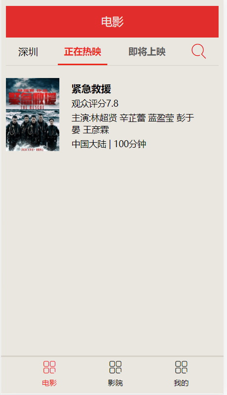
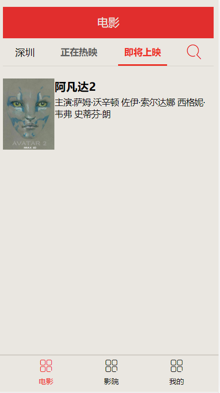

<h2>使用Vue开发的一个仿卖座电影的简易小网站页面</h2>

预览图如下

数据来源于截取的卖座电影的接口

头部导航栏使用二级路由进行跳转

“正在热映”组件下的电影数据由动态路由跳转到电影详情中

底部导航栏使用一级路由进行跳转

“即将上映”组件下的电影数据由Vuex的异步请求进行获取

目前本项目十分简陋，待进一步开发

使用方法:

1.下载整个项目

2.解压

3.打开powershell 输入:

express -e backend
cd backend
cnpm i

4.把解压好的项目中的dist文件夹中的文件全部复制，放进backend文件夹中的public

5.再次打开powershell 输入:
npm start

6.最后浏览器打开 http://localhost:3000 ,就可以预览本项目了
